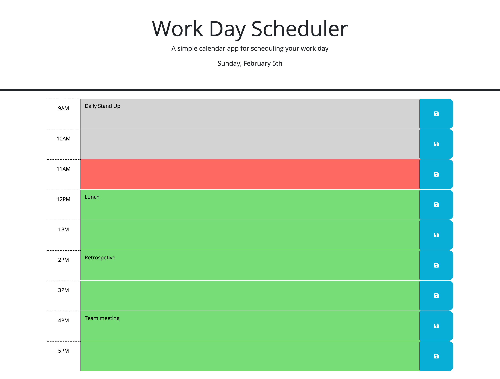

# Work Day Scheduler

## Description

The purpose of this project is to add functionality to a work day scheduler. The schedule is broken into time blocks ranging from 9am to 5pm with an area to insert text and save this input. When a user enters something in these time blocks, the application saves this text into an object and places it in local storage so that the information remains even when the application is closed or refreshed. When the application is first opened, it checks the local storage and populates each of the time blocks with the saved information if this object is not null. If the user updates the information in a time block already populated with data, the object is also updated to reflect these changes and only displays the new input rather than both the new and original text.

The time blocks are also color coded depending on the time of day. The application loops through each time block, retrieves the hour ID of the block, compares it to the current hour from dayjs(), and updates it's CSS class accordingly. Time blocks that have already passed are gray, current time blocks are red, and future time blocks are green.

Lastly, dayjs() is used to display the current date in the header at the top of the schedule to let the user know what day it is.

## Installation

N/A

## Usage

To access this site, use the following link: https://jdeshaies.github.io/work-day-scheduler/

## Credits

N/A

## License

Please refer to the LICENSE in the repo.
